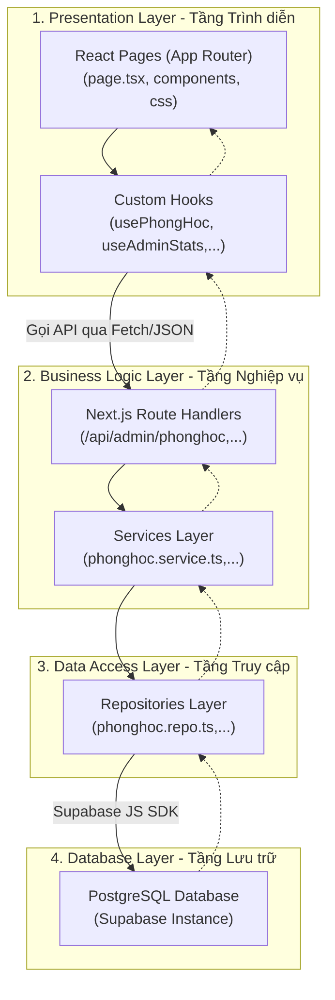
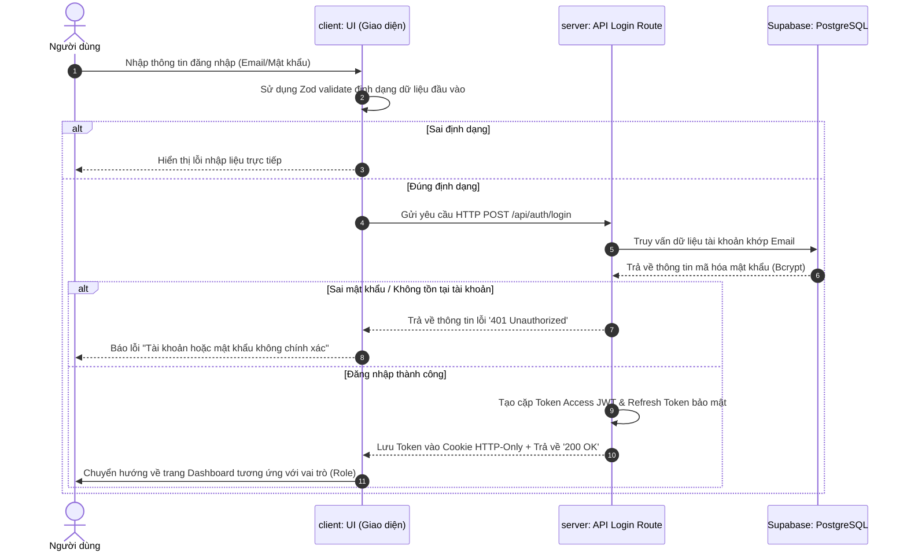

# Hệ thống Quản lý Sinh viên (QLSV)

Hệ thống Quản lý Sinh viên (QLSV) là một giải pháp chuyển đổi số giáo dục toàn diện dành cho các trường đại học, cao đẳng. Hệ thống được thiết kế theo mô hình kiến trúc phân lớp hướng module (Modular Layered Architecture), tối ưu hóa trải nghiệm của Quản trị viên (Admin), Giảng viên (Lecturer) và Sinh viên (Student) trên nền tảng web hiện đại.

---

## Huy hiệu Công nghệ (Tech Badges)


---

## Kiến trúc Hệ thống (System Architecture)

Dự án áp dụng mô hình **Kiến trúc Phân lớp (Layered Architecture)** nghiêm ngặt nhằm tách biệt rõ ràng các nhiệm vụ xử lý và nâng cao khả năng bảo trì hệ thống.



### Chi tiết vai trò từng lớp:
1. **Presentation Layer:** 
   - Nhận nhiệm vụ render giao diện HTML/CSS bằng Next.js React Server & Client Components.
   - Toàn bộ kết nối đến API được cấu trúc gọn gàng bên trong các **React Hooks**, giúp tách rời luồng nạp dữ liệu ra khỏi các thẻ giao diện JSX.
2. **Business Logic Layer:**
   - Tiếp nhận yêu cầu HTTP từ Router Client. Thực thi middleware kiểm tra và giải mã mã độc quyền Token JWT (requireAdmin, requireTeacher, requireStudent).
   - Xử lý các phép toán kiểm tra luật nghiệp vụ (ví dụ: Chặn trùng mã học phần, không cho phép sức chứa nhỏ hơn hoặc bằng 0, chặn xóa thực thể liên kết khóa ngoại).
3. **Data Access Layer:**
   - Đóng gói toàn bộ các cú pháp truy vấn cơ sở dữ liệu vật lý (select, insert, update, delete). 
   - Không chứa logic nghiệp vụ, đảm bảo nếu thay đổi thư viện DB (từ PostgreSQL sang SQL Server, MongoDB) thì chỉ cần cập nhật lớp này.
4. **Database Layer:**
   - PostgreSQL lưu trữ dữ liệu bền vững, áp dụng ràng buộc khóa ngoại (Foreign Keys) để duy trì tính toàn vẹn dữ liệu.

---

## Phân quyền Hệ thống (Role-based Access Control)

Hệ thống quản lý chặt chẽ theo 3 vai trò (Roles) chính của môi trường giáo dục:

| Tính năng | Quản trị viên (Admin) | Giảng viên (Giảng viên) | Sinh viên (Sinh viên) |
| :--- | :---: | :---: | :---: |
| **Xem Tổng quan Thống kê (Dashboard)** | Toàn quyền | Không hỗ trợ | Không hỗ trợ |
| **Quản lý Sinh viên & Giảng viên** | Toàn quyền | Chỉ xem liên quan | Không hỗ trợ |
| **Quản lý Lớp học & Khoa** | Toàn quyền | Chỉ xem lớp dạy | Không hỗ trợ |
| **Quản lý Học kỳ & Môn học** | Toàn quyền | Chỉ xem danh sách | Chỉ xem môn học |
| **Quản lý Phòng học (Rooms)** | Toàn quyền | Chỉ xem phòng | Không hỗ trợ |
| **Quản lý Phân công Giảng dạy** | Toàn quyền | Chỉ xem phân công | Không hỗ trợ |
| **Xếp lịch học (Schedules)** | Toàn quyền | Chỉ xem lịch dạy | Chỉ xem lịch học |
| **Quản lý Điểm số (Grades)** | Toàn quyền | Nhập/Sửa lớp phụ trách | Chỉ xem điểm cá nhân |
| **Gửi Thông báo (Notifications)** | Toàn quyền | Gửi tới lớp phụ trách | Chỉ nhận thông báo |

---

## Các Tính Năng Tiêu Biểu

### 1. Quản lý Phòng học & Tránh trùng lịch
*   **CRUD Phòng học:** Hỗ trợ quản lý phòng học theo các chủng loại đặc thù (Lý thuyết, Thực hành, Trực tuyến) kèm theo cấu hình sức chứa ghế ngồi.
*   **Thống kê Hiệu suất Sử dụng (Utilization Metrics):** Tự động tính toán tổng số tiết học được gán so với công suất chuẩn 60 tiết/tuần để hiển thị thanh mức độ sử dụng: Quá tải (>60%), Tốt (15% - 60%), Ít dùng (1% - 15%), Trống (0%).
*   **Thời khoá biểu Động (Room Timetable Visualizer):** Hiển thị lịch biểu chi tiết 7 ngày trong tuần của phòng học cụ thể thông qua biểu mẫu pop-up trực quan.
*   **Công cụ dò trùng lịch trống (Conflict Checker):** Cho phép admin kiểm tra nhanh xem một khung giờ cụ thể trong tuần có phòng học nào bị xung đột lịch học hay rảnh rỗi.

### 2. Quản lý Đào tạo nâng cao
*   Quản lý thông tin học vụ của Sinh viên bao gồm: Tên, Lớp, Học kỳ, Trạng thái (Đang học, Bảo lưu, Tốt nghiệp).
*   Quản lý phân công giảng viên giảng dạy theo học phần, tự động khóa bảng nhập điểm khi kết thúc học kỳ.

### 3. Bảo mật hệ thống
*   Hệ thống xác thực token kép (Double JWT token) lưu trữ an toàn trong HTTP-Only cookie, tích hợp cơ chế tự động làm mới phiên làm việc (Auto Bearer Refresh Token).
*   Mã hóa mật khẩu đầu cuối và ngăn chặn các nguy cơ tấn công SQL Injection nhờ tầng Repository biên dịch tham số hóa tham số.

---

## Cấu trúc thư mục dự án (Project Directory Structure)

```text
QLSV/
├── app/                              # Next.js App Router
│   ├── (dashboard)/                  # Layout và các trang quản trị
│   │   ├── admin/
│   │   │   ├── dashboard/            # Tổng quan Dashboard
│   │   │   ├── rooms/                # Giao diện Quản lý Phòng học & Thiết bị
│   │   │   ├── students/             # Quản lý Sinh viên
│   │   │   ├── teachers/             # Quản lý Giảng viên
│   │   │   └── ...
│   ├── api/                          # Next.js API Routes (Backend Endpoints)
│   │   ├── admin/
│   │   │   ├── stats/                # API thống kê số liệu tổng quan
│   │   │   ├── phonghoc/             # Collection-level endpoint (/api/admin/phonghoc)
│   │   │   │   ├── route.ts
│   │   │   │   └── [maphong]/        # Item-level dynamic endpoint (/api/admin/phonghoc/[maphong])
│   │   │   │       └── route.ts
│   │   │   └── ...
│   ├── login/                        # Giao diện Đăng nhập hệ thống
│   └── layout.tsx
├── components/                       # Các component giao diện dùng chung
│   ├── admin/                        # Bảng biểu, Dialog, Modal Quản trị viên
│   └── dashboard/                    # Khung Sidebar, Header chung
├── hooks/                            # Custom React Hooks
│   ├── admin/
│   │   ├── usePhonghoc.ts            # Hook tương tác API phòng học
│   │   ├── useAdminStats.ts          # Hook quản lý số liệu thống kê
│   │   └── ...
│   └── auth/                         # Hook quản lý trạng thái Đăng nhập
├── lib/                              # Thư viện và Cấu hình dùng chung
│   ├── utils/
│   │   └── supabase/                 # Khởi tạo kết nối Supabase Client/Server
│   └── validation/                   # Schema kiểm tra định dạng dữ liệu (Zod & Custom)
├── services/                         # Tầng Nghiệp vụ của Hệ thống (Core Backend Logic)
│   ├── repositories/                 # Data Access Layer (DAL - Viết câu lệnh truy vấn)
│   │   └── admin/
│   │       └── phonghoc.repo.ts      
│   └── service/                      # Business Logic Layer (BLL - Xử lý nghiệp vụ hành chính)
│       └── admin/
│           └── phonghoc.service.ts   
├── types/                            # Khai báo kiểu TypeScript và Enum hệ thống
├── public/                           # Các tệp tĩnh (hình ảnh, logo)
├── package.json
└── tsconfig.json
```

---

## Hướng dẫn Cài đặt & Chạy Dự án

### 1. Chuẩn bị môi trường (Prerequisites)
Yêu cầu máy tính của bạn đã cài đặt các công cụ sau:
*   Node.js (Khuyến nghị phiên bản LTS 18.x hoặc 20.x)
*   Git để tải mã nguồn.
*   Tài khoản Supabase đang hoạt động.

### 2. Tải mã nguồn về máy local
```bash
git clone https://github.com/your-username/qlsv.git
cd qlsv
```

### 3. Cài đặt các thư viện liên quan
```bash
npm install
```

### 4. Cấu hình Biến môi trường (.env)
Tạo một tệp tin mới tên là `.env.local` ở thư mục gốc của dự án. 

*Lưu ý bảo mật quan trọng:* Tệp tin `.env.local` chứa các khóa truy cập nhạy cảm và đã được thêm vào `.gitignore` để không bị đẩy lên GitHub hoặc lộ lọt ra bên ngoài. Các giá trị cấu hình được mô tả dưới dạng biến rỗng để người quản trị tự điền thông tin thực tế:

```env
# URL liên kết với dự án Supabase cá nhân
NEXT_PUBLIC_SUPABASE_URL=YOUR_SUPABASE_URL

# Khóa nặc danh dùng cho xử lý client-side
NEXT_PUBLIC_SUPABASE_ANON_KEY=YOUR_SUPABASE_ANON_KEY

# Khóa dịch vụ cấp cao vượt qua bộ lọc hàng (RLS bypass) - Chỉ dùng tại server-side
SUPABASE_SERVICE_ROLE_KEY=YOUR_SUPABASE_SERVICE_ROLE_KEY

# Chuỗi bí mật dùng để mã hóa và ký nhận diện token JWT
JWT_SECRET=YOUR_JWT_SECRET
```

---

## Cách Chạy Dự Án

### Khởi chạy máy chủ phát triển (Development Mode)
```bash
npm run dev
```
Mở trình duyệt và truy cập: http://localhost:3000 để sử dụng ứng dụng.

### Biên dịch và tối ưu ứng dụng cho Production
```bash
# Biên dịch ứng dụng thành mã tối ưu hóa
npm run build

# Khởi động máy chủ chính thức
npm start
```

---

## Ví dụ Thiết kế API (API Endpoint Specs)

Dự án tuân thủ nghiêm ngặt chuẩn thiết kế URL RESTful động. Ví dụ dưới đây là quy trình xử lý API của đối tượng Phòng học (phonghoc):

### 1. Xem chi tiết và lịch biểu của một phòng học cụ thể
*   **Endpoint:** `GET /api/admin/phonghoc/[maphong]?schedule=true`
*   **Tham số động:** `maphong` là mã phòng cụ thể (Ví dụ: `A1.302`).
*   **Mô tả phản hồi thành công (JSON - 200 OK):**
```json
{
  "success": true,
  "data": [
    {
      "malichhoc": 102,
      "thutrongtuan": 3,
      "tietbatdau": 1,
      "tietketthuc": 3,
      "ghichu": "Phòng máy thực hành",
      "monhoc": "Cấu trúc dữ liệu và giải thuật",
      "giangvien": "Nguyễn Văn A",
      "lop": "CNTT-K15",
      "hocky": "Học kỳ 1 năm học 2025-2026"
    }
  ]
}
```

### 2. Cập nhật phòng học
*   **Endpoint:** `PUT /api/admin/phonghoc/[maphong]`
*   **Payload yêu cầu (JSON Body):**
```json
{
  "loaiphong": "Thuchanh",
  "suchua": 80
}
```
*   **Phản hồi thành công (JSON - 200 OK):**
```json
{
  "success": true,
  "data": {
    "maphong": "LAB-02",
    "loaiphong": "Thuchanh",
    "suchua": 80
  }
}
```

---

## Sơ đồ Quy trình Hoạt động (Workflow Diagrams)

### Luồng Đăng nhập & Xác thực JWT (Authentication Flow)



---

## Chính sách An toàn & Bảo mật (Security Best Practices)

Hệ thống được thiết kế dựa trên các nguyên tắc lập trình an toàn hàng đầu:

1.  **Chống tấn công SQL Injection:** Toàn bộ tầng Repository không bao giờ cộng chuỗi SQL thô. Tất cả tương tác đều được tham số hóa nhờ cơ chế ORM biên dịch sẵn của Supabase Client.
2.  **Bảo vệ Cookie phía Client:** Cặp Token xác thực JWT được cấu hình lưu trữ với các cờ đặc biệt `HttpOnly`, `Secure` và `SameSite=Strict` nhằm triệt tiêu hoàn toàn nguy cơ rò rỉ Token qua các kịch bản tấn công XSS (Cross-Site Scripting).
3.  **Xác thực dữ liệu 2 lớp:** Ngăn chặn tuyệt đối dữ liệu bất hợp lệ bằng cách kiểm tra định dạng đầu vào đồng thời ở cả phía Client (Zod và Form Validation) lẫn phía Server (Service Layer Validation).

---

## Hướng dẫn Deploy dự án lên Vercel

Việc triển khai trang web được thực hiện nhanh chóng thông qua nền tảng đám mây **Vercel**:

1.  Đẩy mã nguồn dự án lên kho lưu trữ cá nhân tại GitHub.
2.  Truy cập trang quản trị Vercel và đăng nhập bằng tài khoản GitHub.
3.  Click chọn nút **Add New** -> **Project** rồi chọn kho chứa mã nguồn dự án `qlsv`.
4.  Trong mục **Configure Project**, mở rộng phần **Environment Variables** và tiến hành thêm đầy đủ các khóa bảo mật đã chuẩn bị (giống tệp cấu hình `.env.local` ở trên).
5.  Click vào nút **Deploy** và đợi quá trình cài đặt hoàn tất. Vercel sẽ cung cấp đường link website chính thức dạng HTTPS để sử dụng ngoài thực tế.

---

## Hướng phát triển trong tương lai (Future Roadmap)

- [ ] Tích hợp tính năng Điểm danh thông minh bằng khuôn mặt (Face Recognition) và quét mã QR Code phiên bản động.
- [ ] Gửi thông báo học vụ tự động qua ứng dụng chat Telegram và Email cho phụ huynh.
- [ ] Xây dựng phân hệ AI phân tích sức học và đề xuất gợi ý học phần giúp sinh viên cải thiện điểm tích lũy.

---
> Đây là dự án thực nghiệm mã nguồn mở phục vụ mục đích học tập và nghiên cứu công nghệ thông tin. Vui lòng ghi rõ nguồn khi tái phát hành sản phẩm.
